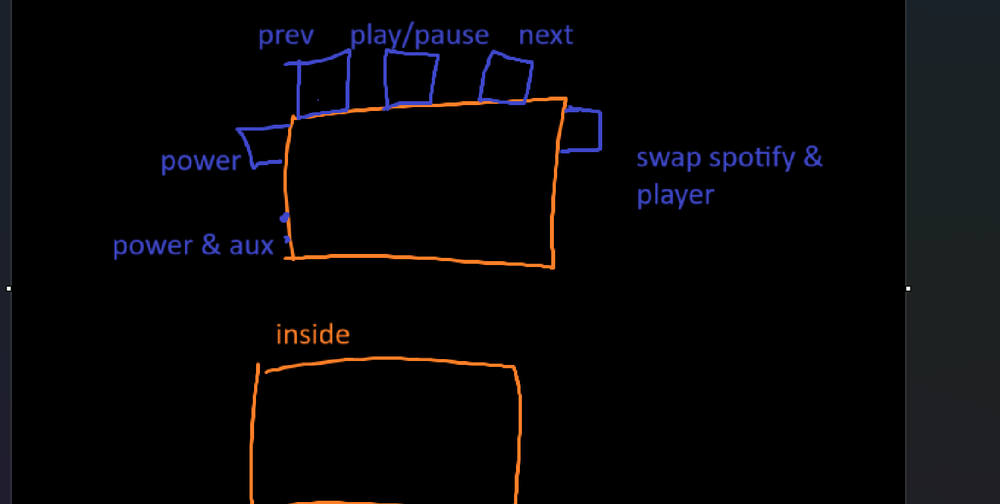

I want to make a custom portable music player that had a general fox theme
i would love to try and incorparate somekind of celluar so it can always be used as well as headphone and bluetooth compatiabilty. It of course needs to be able to play spotify songs and i would love if i can make it select playlist you may have! I am also looking at adding in a music player so that you can download songs directly and use that instead of spotify (if you dont have premium or yours songs just arent on spotify)

# June 14-16th: researching parts
Since i Wanted celluar and a touchscreen thats what i started off looking for. I found an adafruit screen that seeemed promising but pon clsoer inspection, it was out of stock wit an unknown lead time :c
i then swapped to a generic ILI9341 display. my celluar module had a lead time of 4-5 weeks :c and was priced super expensive as well. so i went with a Quectel EG25-G instead. My main audio codec that looked super promsiing turned out to be obeslete, which if not for [Suya](https://github.com/Suya1671) I would not have noticed :(
And becuase of that i then spent a good blurry half hour completely redesinging my audio layout
Now I'm off to look at data sheets before i even think abt opening kicad :c

# Foxify Portable Music Player - BOM

### Core Processing & Connectivity

| **Component** | **Part Number** | **Manufacturer** | **Qty** | **Unit Cost** | **Total** | **Lead Time** | **LCSC Part #** | **Purchase Links** | **CAD Models** | **Notes** |
|---------------|-----------------|------------------|---------|---------------|-----------|---------------|-----------------|-------------------|----------------|-----------|
| **Main MCU** | ESP32-S3-WROOM-1-N16R8 | Espressif | 1 | $3.75 | $3.75 | 1-3 days | C2913202 | [LCSC](https://lcsc.com/product-detail/WiFi-Modules_Espressif-Systems-ESP32-S3-WROOM-1-N16R8_C2913202.html) • [DigiKey](https://www.digikey.com/en/products/detail/espressif-systems/ESP32-S3-WROOM-1-N16R8/16162642) | [Ultra Librarian](https://app.ultralibrarian.com/details/43a856eb-9b99-11ee-b2d2-0ae0a3b49db5/Espressif-Systems/ESP32-S3-WROOM-1-N16R8) • [SnapEDA](https://www.snapeda.com/parts/ESP32-S3-WROOM-1-N16R8/Espressif%20Systems/view-part/) |  16MB Flash, 8MB PSRAM |
| **Cellular Module** | EG25-G | Quectel | 1 | $49.99 | $49.99 | 5-10 days | External Source | [M2MSupport](https://m2msupport.net/m2msupport/product/quectel-wireless-eg25-g-4g-lte-lcc-module/) • [Amazon](https://www.amazon.com/Generic-Quectel-EG25-G-Cellular-M2M-optimized/dp/B0CVQ2YLQQ) | [Quectel CAD](https://www.quectel.com/product/lte-eg25-g/) |  LTE Cat 4, Global bands |
| **SIM Connector** | 2174803-2 | TE Connectivity | 1 | $1.95 | $1.95 | 2-5 days | External Source | [DigiKey](https://www.digikey.com/en/products/detail/te-connectivity-amp-connectors/2174803-2/5664600) • [Mouser](https://www.mouser.com/ProductDetail/571-2174803-2) | [TE Connectivity](https://www.te.com/usa-en/product-2174803-2.html) | Nano SIM push-push socket |
| **Cellular Antenna** | FXP73.07.0100A | Taoglas | 1 | $4.04 | $4.04 | 3-7 days | External Source | [DigiKey](https://www.digikey.com/product-detail/en/taoglas-limited/FXP73.07.0100A/931-1076-ND/2332703) | [Octopart](https://octopart.com/fxp73.07.0100a-taoglas-19249590) | Flexible LTE antenna, 100mm cable |
| **WiFi/BT Antenna** | 2450AT18A100 | Johanson | 1 | $1.20 | $1.20 | 1-3 days | External Source | [DigiKey](https://www.digikey.com/en/products/detail/johanson-technology/2450AT18A100/1560836) | Johanson Library | 2.4GHz chip antenna |

**Subtotal: $60.93**

---

### Audio System

| **Component** | **Part Number** | **Manufacturer** | **Qty** | **Unit Cost** | **Total** | **Lead Time** | **LCSC Part #** | **Purchase Links** | **CAD Models** | **Notes** |
|---------------|-----------------|------------------|---------|---------------|-----------|---------------|-----------------|-------------------|----------------|-----------|
| **Audio Codec** | ES8388 | Everest Semi | 1 | $0.51 | $0.51 | 1-3 days | C365736 | [LCSC](https://lcsc.com/product-detail/Codec-ICs_Everest-semi-Everest-Semiconductor-ES8388_C365736.html) | [LCSC Datasheet](https://datasheet.lcsc.com/lcsc/1912111437_Everest-semi-Everest-Semiconductor-ES8388_C365736.pdf) | ESP-ADF support |
| **Speaker Amp** | MAX98357AETE+T | Maxim/ADI | 1 | $1.06 | $1.06 | 1-3 days | C910544 | [LCSC](https://lcsc.com/product-detail/Audio-Power-OpAmps_Analog-Devices-Inc-Maxim-Integrated-MAX98357AETE-T_C910544.html) | [Analog Devices](https://www.analog.com/en/products/max98357a.html) |  3.2W Class D, I2S input |
| **Headphone Amp** | TPA6130A2RTJR | Texas Instruments | 1 | $2.85 | $2.85 | 3-7 days | External Source | [DigiKey](https://www.digikey.com/en/products/detail/texas-instruments/TPA6130A2RTJR/1213326) | [TI CAD Models](https://www.ti.com/product/TPA6130A2) | I2C controlled, 138mW/16Ω |
| **Audio Jack** | SJ1-3533NG | CUI Devices | 1 | $1.43 | $1.43 | 2-5 days | External Source | [DigiKey](https://www.digikey.com/en/products/detail/cui-devices/SJ1-3533NG/738701) | [CUI Official](https://www.cuidevices.com/product/interconnect/connectors/audio-connectors/jacks/sj1-3533ng) | 3.5mm TRRS with detection |
| **Speaker** | CSS-40408N | CUI Devices | 1 | $4.25 | $4.25 | 3-7 days | External Source | [SameSky](https://www.sameskydevices.com/product/audio/speakers/miniature-(10-mm~40-mm)/css-40408n) | [SameSky CAD](https://www.sameskydevices.com/product/audio/speakers/miniature-(10-mm~40-mm)/css-40408n) | 40mm 4Ω 3W speaker |
| **Audio Caps** | C0805C104K5RAC | KEMET | 8 | $0.08 | $0.64 | 1-2 days | C49678 | [LCSC](https://lcsc.com/product-detail/Multilayer-Ceramic-Capacitors-MLCC-SMD-SMT_KEMET-C0805C104K5RAC7210_C49678.html) | Standard 0805 | 0.1µF X7R coupling caps |
| **Ferrite Beads** | BLM18PG221SN1D | Murata | 4 | $0.022 | $0.088 | 1-3 days | C1042 | [LCSC](https://lcsc.com/product-detail/Ferrite-Beads_Murata-Electronics-BLM18PG221SN1D_C1042.html) | Standard 0603 | 220Ω@100MHz |

**Subtotal: $10.83**

---

### Display & User Interface

| **Component** | **Part Number** | **Manufacturer** | **Qty** | **Unit Cost** | **Total** | **Lead Time** | **LCSC Part #** | **Purchase Links** | **CAD Models** | **Notes** |
|---------------|-----------------|------------------|---------|---------------|-----------|---------------|-----------------|-------------------|----------------|-----------|
| **LCD Display** | 3.2" ILI9341 SPI | Generic/HiLetgo | 1 | $12.99 | $12.99 | 7-14 days | External Source | [Amazon](https://www.amazon.com/XIITIA-Display-ILI9341-240x320-Screen/dp/B0CJJ13VX1) • [AliExpress](https://www.aliexpress.com/item/33015586094.html) | Generic ILI9341 | 320×240 resistive touch |
| **Display Connector** | FH12-24S-0.5SH(55) | Hirose | 1 | $1.68 | $1.68 | 2-5 days | C283132 | [LCSC](https://lcsc.com/product-detail/FFC-FPC-Connectors_Hirose-Electric-FH12-24S-0-5SH-55_C283132.html) | [Hirose CAD](https://www.hirose.com/product/series/FH12) | 24-pin 0.5mm FPC |
| **Touch Connector** | FH12-6S-0.5SH(55) | Hirose | 1 | $1.45 | $1.45 | 2-5 days | C283048 | [LCSC](https://lcsc.com/product-detail/FFC-FPC-Connectors_Hirose-Electric-FH12-6S-0-5SH-55_C283048.html) | [Hirose CAD](https://www.hirose.com/product/series/FH12) | 6-pin 0.5mm FPC |
| **Tactile Buttons** | SKHHPKA010 | Alps Alpine | 4 | $0.95 | $3.80 | 3-7 days | External Source | [LCSC](https://lcsc.com/product-detail/Tactile-Switches_ALPS-Electric-SKHHPKA010_C318884.html) | Alps Library | 6mm tactile switches |
| **Rotary Encoder** | PEC11R-4220F-S0024 | Bourns | 1 | $8.20 | $8.20 | 5-10 days | External Source | [DigiKey](https://www.digikey.com/en/products/detail/bourns-inc/PEC11R-4220F-S0024/1088313) | [Bourns Official](https://www.bourns.com/products/encoders/optical-encoders) | 24-pulse encoder with switch |

**Subtotal: $28.12**

---

### Power Management & Battery

| **Component** | **Part Number** | **Manufacturer** | **Qty** | **Unit Cost** | **Total** | **Lead Time** | **LCSC Part #** | **Purchase Links** | **CAD Models** | **Notes** |
|---------------|-----------------|------------------|---------|---------------|-----------|---------------|-----------------|-------------------|----------------|-----------|
| **Battery Charger** | TP4056 | TPOWER | 1 | $0.049 | $0.049 | 1-2 days | C382139 | [LCSC](https://lcsc.com/product-detail/Battery-Management-ICs_TPOWER-TP4056_C382139.html) | [LCSC Datasheet](https://datasheet.lcsc.com/szlcsc/TPOWER-TP4056_C382139.pdf) | 1A Li-Ion charger |
| **USB-C PD Controller** | IP5328P | Injoinic | 1 | $5.50 | $5.50 | 7-14 days | External Source | [AliExpress](https://www.aliexpress.com/wholesale?catId=0&initiative_id=SB_20230615074837&SearchText=IP5328P) | Custom footprint | PD 3.0 up to 18W |
| **Battery** | 18650 Li-Ion 3000mAh | Generic | 2 | $3.50 | $7.00 | 3-7 days | External Source | [Amazon](https://www.amazon.com/s?k=18650+battery+3000mah+protected) | Standard 18650 | Protected cells recommended |
| **USB-C Connector** | USB4105-GF-A-060 | Global Connector | 1 | $0.69 | $0.69 | 1-3 days | C3025063 | [LCSC](https://lcsc.com/product-detail/usb-connectors_global-connector-technology-usb4105-gf-a-060_c3025063.html) | [SnapEDA](https://www.snapeda.com/parts/USB4105-GF-A/Global%20Connector%20Technology/view-part/) | USB-C receptacle 5A rated |
| **Fuel Gauge** | MAX17048G+T10 | Maxim/ADI | 1 | $2.01 | $2.01 | 3-7 days | External Source | [DigiKey](https://www.digikey.com/en/products/detail/maxim-integrated/MAX17048G-T10/3758921) | [Maxim CAD](https://www.analog.com/en/products/max17048.html) | Battery monitoring IC |
| **Protection IC** | DW01+ | PJSEMI | 1 | $0.029 | $0.029 | 1-2 days | C686633 | [LCSC](https://lcsc.com/product-detail/Battery-Management_PJSEMI-DW01_C686633.html) | SOT-23-5 | Battery protection |
| **Power MOSFETs** | AO3401A | Alpha & Omega | 2 | $0.44 | $0.88 | 1-3 days | C15127 | [LCSC](https://lcsc.com/product-detail/MOSFETs_Alpha-Omega-Semicon-AO3401A_C15127.html) | SOT-23 | P-channel 30V 4A |
| **Status LEDs** | LTST-C19HE1WT | Lite-On | 4 | $0.12 | $0.48 | 1-3 days | C75588 | [LCSC](https://lcsc.com/product-detail/Light-Emitting-Diodes-LED_Lite-On-LTST-C19HE1WT_C75588.html) | 0606 RGB | RGB status indicators |
| **Power Switch** | EG1218 | E-Switch | 1 | $0.95 | $0.95 | 3-7 days | External Source | [DigiKey](https://www.digikey.com/en/products/detail/e-switch/EG1218/101726) | E-Switch CAD | SPDT slide switch |
| **LDO Regulators** | AP2112K-3.3TRG1 | Diodes Inc | 2 | $0.35 | $0.70 | 1-3 days | C51118 | [LCSC](https://lcsc.com/product-detail/Linear-Voltage-Regulators-LDO_Diodes-Incorporated-AP2112K-3-3TRG1_C51118.html) | SOT-23-5 | 3.3V 600mA LDO |

**Subtotal: $18.30**

---

### Passive Components & Support ICs

| **Component** | **Part Number** | **Manufacturer** | **Qty** | **Unit Cost** | **Total** | **Lead Time** | **LCSC Part #** | **Purchase Links** | **CAD Models** | **Notes** |
|---------------|-----------------|------------------|---------|---------------|-----------|---------------|-----------------|-------------------|----------------|-----------|
| **Capacitors 0805 (0.1µF)** | C0805C104K5RAC | KEMET | 20 | $0.008 | $0.16 | 1-2 days | C49678 | [LCSC](https://lcsc.com/product-detail/Multilayer-Ceramic-Capacitors-MLCC-SMD-SMT_KEMET-C0805C104K5RAC7210_C49678.html) | Standard 0805 | Bypass capacitors |
| **Capacitors 0805 (1µF)** | C0805C105K5RAC | KEMET | 10 | $0.012 | $0.12 | 1-2 days | C28323 | [LCSC](https://lcsc.com/product-detail/Multilayer-Ceramic-Capacitors-MLCC-SMD-SMT_KEMET-C0805C105K5RAC7210_C28323.html) | Standard 0805 | Power filtering |
| **Capacitors 1206 (22µF)** | C1206C226K5RAC | KEMET | 6 | $0.25 | $1.50 | 1-2 days | C15008 | [LCSC](https://lcsc.com/product-detail/Multilayer-Ceramic-Capacitors-MLCC-SMD-SMT_KEMET-C1206C226K5RAC7800_C15008.html) | Standard 1206 | High-value ceramics |
| **Tantalum Caps (47µF)** | T491C476K010AT | KEMET | 4 | $0.45 | $1.80 | 2-5 days | External Source | [DigiKey](https://www.digikey.com/en/products/detail/kemet/T491C476K010AT/818059) | C-case tantalum | Audio coupling |
| **Resistors 0603 (10kΩ)** | RC0603FR-0710KL | Yageo | 30 | $0.003 | $0.09 | 1-2 days | C25804 | [LCSC](https://lcsc.com/product-detail/Chip-Resistor-Surface-Mount_Yageo-RC0603FR-0710KL_C25804.html) | Standard 0603 | General purpose |
| **Resistors 0603 (4.7kΩ)** | RC0603FR-074K7L | Yageo | 10 | $0.003 | $0.03 | 1-2 days | C23162 | [LCSC](https://lcsc.com/product-detail/Chip-Resistor-Surface-Mount_Yageo-RC0603FR-074K7L_C23162.html) | Standard 0603 | I2C pullups |
| **Crystal (12MHz)** | NX5032GA-12MHz | NDK | 1 | $0.85 | $0.85 | 2-5 days | C390763 | [LCSC](https://lcsc.com/product-detail/Crystals_NDK-NX5032GA-12-000000MHZ-LN-CD-1_C390763.html) | 5×3.2mm SMD | Main oscillator |
| **Inductors (1µH)** | MLZ2012M1R0WT000 | TDK | 4 | $0.35 | $1.40 | 1-3 days | C85953 | [LCSC](https://lcsc.com/product-detail/Inductors-SMD_TDK-MLZ2012M1R0WT000_C85953.html) | Standard 0805 | Power filtering |

**Subtotal: $5.95**

---

### Mechanical & Enclosure

| **Component** | **Part Number** | **Manufacturer** | **Qty** | **Unit Cost** | **Total** | **Lead Time** | **LCSC Part #** | **Purchase Links** | **CAD Models** | **Notes** |
|---------------|-----------------|------------------|---------|---------------|-----------|---------------|-----------------|-------------------|----------------|-----------|
| **Screen Protector** | Custom Acrylic 3.2" | Ponoko/SendCutSend | 1 | $8.00 | $8.00 | 5-10 days | Custom | [Ponoko](https://www.ponoko.com/) • [SendCutSend](https://sendcutsend.com/) | Custom design | Laser-cut acrylic lens |
| **O-Ring Gaskets** | AS568-004 | Parker | 4 | $0.50 | $2.00 | 3-7 days | External Source | [McMaster-Carr](https://www.mcmaster.com/gaskets/) | McMaster CAD | Sealing gaskets |
| **Screws M2.5×8mm** | 91292A003 | McMaster-Carr | 8 | $0.10 | $0.80 | 2-5 days | External Source | [McMaster-Carr](https://www.mcmaster.com/91292A003/) | McMaster STEP | Stainless SHCS |
| **Standoffs M2.5×8mm** | 24308 | Keystone | 6 | $0.65 | $3.90 | 3-7 days | External Source | [DigiKey](https://www.digikey.com/en/products/detail/keystone-electronics/24308/280425) | Keystone 3D | Hex brass standoffs |

**Subtotal: $14.70**

---

 **TOTAL: $146.83** 
~~~~~~~~~~~~~~
have spent ~6 hours researching parts
~~~~~~~~~~~~~~